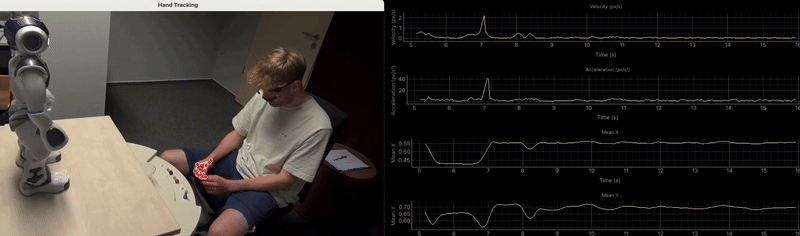

Psycholinguistics\
Zukunftsmeile 2, Paderborn University\
33102 Paderborn, Germany\
**Phone:** +49-(0)5251-60-4491\
**Email:** amit dot singh at uni hyphen paderborn dot de

I am currently a doctoral candidate in Psycholinguistics at SFB TRR318 [„Constructing Explainability“](https://trr318.uni-paderborn.de), a collaborative research center at Paderborn and Bielefeld University. As part of [Project-A05](https://trr318.uni-paderborn.de/projekte/a05), I am working under the joint supervision of [Prof. Dr. Katharina Rohlfing](https://www.uni-paderborn.de/person/50352), [Prof. Dr.-Ing. Britta Wrede](https://ekvv.uni-bielefeld.de/pers_publ/publ/PersonDetail.jsp?personId=10380), and [Prof. Dr. Ingrid Scharlau](https://kw.uni-paderborn.de/fach-psychologie/kognitive-psychologie/). Before joining SFB, I completed my M.Sc. in Cognitive Science from University of Hyderabad. 

My research focuses on the role of multimodal cues in shaping social interaction, with particular emphasis on how language and vision interact in real-time communication setting.  I investigate cognitive processess underlying social interaction, particularly how individuals engaged in conversations - be it between humans or between human and a robot - leverage a myraid of cues and multimodal signals to establish shared context, negotiate mutual understanding, and coordinate joint actions.

To look into these processes, I have been using online experimental methods (including remote and mobile eye-tracking) and statistical modelling (both Bayesian and frequentist) to analyze data from psycholinguistic experiments. 

<table>
  <tr>
    <td></td>
  </tr>
 </table>
*source: SprachSpielLabor, Paderborn University

## Brief CV

Year | Activity | Affiliation
-----|------- | -----------
2021 - pres. | Doctoral Candidate | Paderborn University
2020 | MSc Cognitive Science | University of Hyderabad 
2019 | Research Intern | Software Engineering Research Center, IIIT Hyderabad
2018 | Data Associate - German (full-time)| Alexa Ops. Amazon Development Center, Bangalore
2017 | B.A. Honours German | Jawaharlal Nehru University (JNU), New Delhi
2014 | Certificate in German Language | University of Delhi
