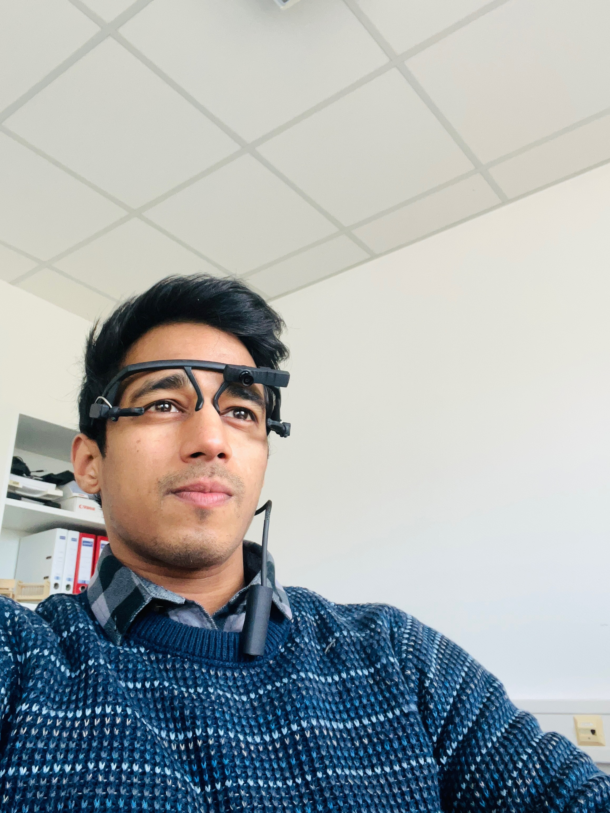

Psycholinguistics\
Zukunftsmeile 2, Paderborn University\
33102 Paderborn, Germany\
**Phone:** +49-(0)5251-60-4491\
**Email:** amit dot singh at uni hyphen paderborn dot de

I am a doctoral candidate at SFB TRR318 [„Constructing Explainability“](https://trr318.uni-paderborn.de), a collaborative research center at Paderborn and Bielefeld University. As part of [Project-A05](https://trr318.uni-paderborn.de/projekte/a05), I am working under the joint supervision of [Prof. Dr. Katharina Rohlfing](https://www.uni-paderborn.de/person/50352), [Prof. Dr.-Ing. Britta Wrede](https://ekvv.uni-bielefeld.de/pers_publ/publ/PersonDetail.jsp?personId=10380), and [Prof. Dr. Ingrid Scharlau](https://kw.uni-paderborn.de/fach-psychologie/kognitive-psychologie/). Before joining SFB, I completed a Master's in Cognitive Science. 

My broad research interest lies in exploring the online dynamics of multimodal integration (language and vision) in Human-Human and Human-Robot interactional settings. 
I investigate questions such as how individuals engaged in conversation leverage a myriad of visual and verbal cues to establish shared context, negotiate mutual understanding, and coordinate joint actions. 

I mostly use eye tracking (mobile and remote), HRI experiments, and statistical modeling to explore these questions. 

My hope is to utilize these findings to incorporate verbal scaffolding strategies in artificial systems that are tailored to users' capabilities, informed by their interaction history, and essentially grounded in cognition.

<table>
  <tr>
    <td></td>
  </tr>
</table>

## Updates

  <iframe
    src="https://www.youtube-nocookie.com/embed/h2ZzJB7nyt0?si=zLi3J00ospjOBiHH"
    title="19.10.2025, Talk at IEEE International Conference on Development and Learning (ICDL) 2025, Prague"
    frameborder="0"
    allow="accelerometer; autoplay; clipboard-write; encrypted-media; gyroscope; picture-in-picture; web-share"
    allowfullscreen>
  </iframe>

