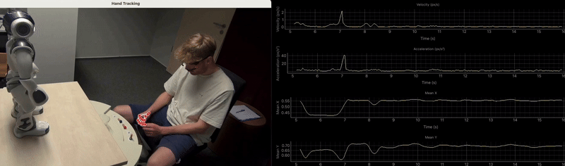

<section class="hero">
  

    
Doctoral Candidate - Psycholinguistics - Paderborn University

    

      I am a doctoral candidate at SFB TRR318 "Constructing Explainability", a collaborative research
      center at Paderborn and Bielefeld University.
    

    

      As part of <a href="https://trr318.uni-paderborn.de/projekte/a05">Project-A05</a>, I am working
      under the joint supervision of
      <a href="https://www.uni-paderborn.de/person/50352">Prof. Dr. Katharina Rohlfing</a>,
      <a href="https://ekvv.uni-bielefeld.de/pers_publ/publ/PersonDetail.jsp?personId=10380">Prof. Dr.-Ing. Britta Wrede</a>,
      and <a href="https://kw.uni-paderborn.de/fach-psychologie/kognitive-psychologie/">Prof. Dr. Ingrid Scharlau</a>.
      Before joining SFB, I completed a Master's in Cognitive Science.
    

    

      Eye tracking
      Human-robot interaction
      Multimodal communication
    

    

      

        Office
        
          Psycholinguistics 
          Zukunftsmeile 2 
          33102 Paderborn, Germany
        
      

      

        Phone
        +49-(0)5251-60-4491
      

      

        Email
        amit.singh@uni-paderborn.de
      

    

  

  

      
    

      <h3>Research focus</h3>
      

        My work examines the online dynamics of multimodal integration (language and vision) in
        human-human and human-robot interaction settings.
      

    

  

</section>

<section class="section">
  <h2>Approach</h2>
  

    I investigate questions such as how individuals engaged in conversation leverage a myriad of
    visual and verbal cues to establish shared context, negotiate mutual understanding, and
    coordinate joint actions.
  

  

    I mostly use eye tracking (mobile and remote), HRI experiments, and statistical modeling to
    explore these questions.
  

  

    My hope is to use these findings to incorporate verbal scaffolding strategies in artificial
    systems that are tailored to users' capabilities, informed by their interaction history, and
    grounded in cognition.
  

</section>

<section class="section">
  <figure class="image-card">
    
    <figcaption>Scenario illustration from multimodal interaction studies.</figcaption>
  </figure>
</section>

<section class="section">
  

    

      <h2>Recent talk</h2>
      
19.10.2025, Talk at IEEE International Conference on Development and Learning (ICDL) 2025, Prague.

      

        <a class="button-link" href="https://doi.org/10.1109/ICDL63968.2025.11204385">Paper link</a>
        <a class="button-link secondary" href="https://www.youtube.com/watch?v=h2ZzJB7nyt0">Watch on YouTube</a>
      

    

    

      <iframe
        src="https://www.youtube-nocookie.com/embed/h2ZzJB7nyt0?si=zLi3J00ospjOBiHH"
        title="Talk at IEEE International Conference on Development and Learning (ICDL) 2025, Prague"
        frameborder="0"
        loading="lazy"
        referrerpolicy="strict-origin-when-cross-origin"
        allow="accelerometer; autoplay; clipboard-write; encrypted-media; gyroscope; picture-in-picture; web-share"
        allowfullscreen>
      </iframe>
    

  

</section>
