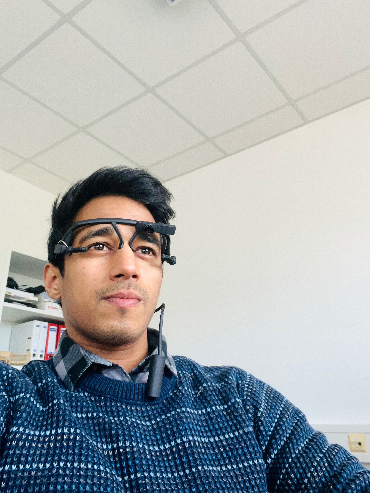

Psycholinguistics
Zukunftsmeile 2, Paderborn University
33098 Paderborn, Germany
Phone: +49-(0)5251-60-4491
Email: amit dot singh at uni hyphen paderborn dot de

I am currently a doctoral candidate in Psycholinguistics at SFB TRR318 [„Constructing Explainability“](https://trr318.uni-paderborn.de), a collaborative research center at Paderborn and Bielefeld University. Within the SFB TRR318, I am engaged in [Project-A05](https://trr318.uni-paderborn.de/projekte/a05), a specific research project under the joint supervision of Prof. Katharina Rohlfing, Prof. Britta Wrede, and Prof. Ingrid Scharlau.

Before joining RTG at TRR318, I completed my BA (Honours) in Germanistik from Jawaharlal Nehru University (JNU, India), and M.Sc. in Cognitive Science from University of Hyderabad (UoH, India). Since then I have been investigating the online cognitive processes underlying language and vision, and how these two concurrently influence each other. 

Recently, I've been shifting my research focus away from classical psycholinguistic experiments conducted in isolation and instead placing a stronger emphasis on studying the dynamics of human interaction as the main object of investigation, particularly within the realm of pragmatics. Particularly, I am interested to study the intricacies of social interaction processes, how individuals engaged in conversations, be it between humans or between human and a robot, leverage a myriad of pragmatic cues to collectively establish a shared context and joint goal within a single communicative framework.

My methodologies include, Eye-tracking (Remote and Mobile) and conversational analysis.

<table>
src: ACCL
  <tr>
    <td></td>
    <td></td>
  </tr>
 </table>

As a side activity and a hobby, I like to do lyrical-bollywood dance and photography.

## Brief CV

Year | Activity | Affiliation
-----|------- | -----------
2021 - pres. | Doctoral Candidate | Paderborn University
2020 | MSc Cognitive Science | University of Hyderabad 
2018 | Data Associate - German (full-time)| Alexa Ops. Amazon Development Center, Bangalore
2017 | B.A. Honours German | Jawaharlal Nehru University (JNU), New Delhi
2014 | Certificate in German Language | University of Delhi

