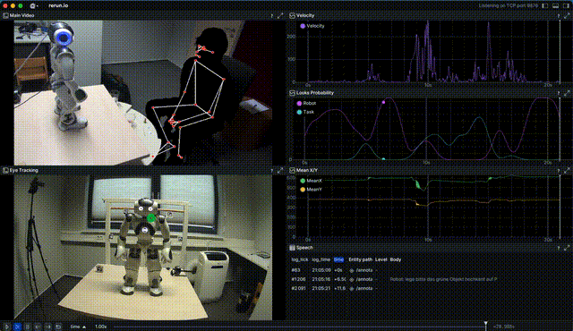

<section class="section">
  <h1>Projects</h1>
  

    <article class="project-card">
      
      

        <h3>WinGaze</h3>
        

          WinGaze is a tool for aligning and visualizing eye gaze data from human-robot interaction (HRI)
          experiments with manual annotations (for example, from ELAN). It enables detailed exploration
          of gaze patterns within annotated time windows to support behavioral analysis.
        

        <a class="button-link secondary" href="https://github.com/amits1ngh/WinGaze">View on GitHub</a>
      

    </article>
  

</section>
